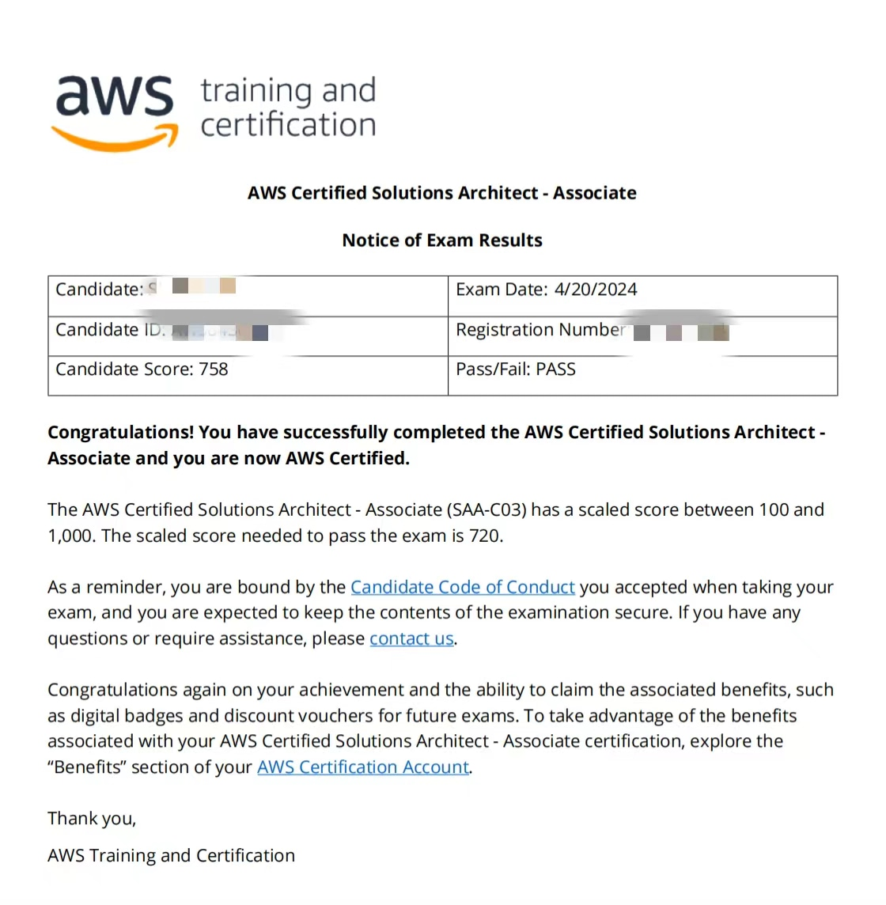

# AWS Certified Solutions Architect Associate SAA-C03

English / [简体中文](./README_CN.md)

The AWS Certified Solutions Architect Associate SAA-C03 certification exam is one of the most challenging exams. It not only assesses your understanding of AWS well, but also ensures that you make the best architecture decisions based on the situation, making it very valuable to obtain and pass the certification.

  

## Exam purpose
To learn about architecture knowledge and practice English simultaneously.

## Learning Journey
- I recommend taking Stephane Maarek's course on Udemy. I listened to it intermittently for a month.
- I practiced over 800 English questions consistently for a month.

## Things Learned After Attending the Exam
- If you choose English as the exam language, you can apply for language convenience before scheduling the exam. Once the exam is scheduled, no further applications can be made.
- The English name provided when creating an AWS Builder account must match the corresponding auxiliary documents, such as a passport. During the exam, you need to bring your ID card and relevant auxiliary documents.
- If possible, choose the online exam to complete it in a quiet environment. I attended an offline exam in an open classroom with constant people coming in and out, but luckily, the exam room provided noise-canceling headphones.