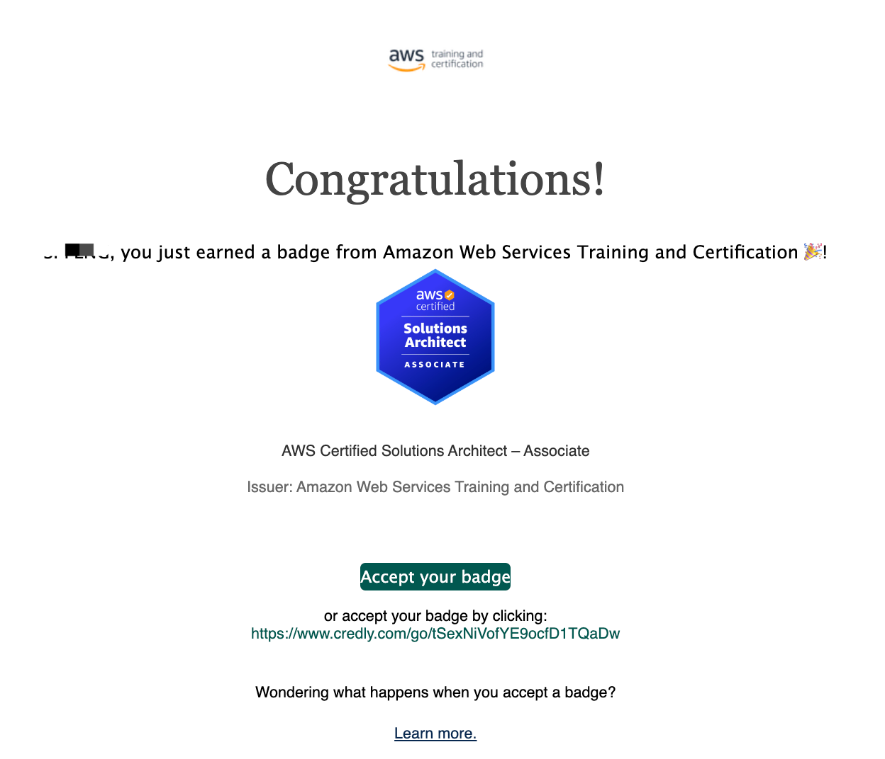
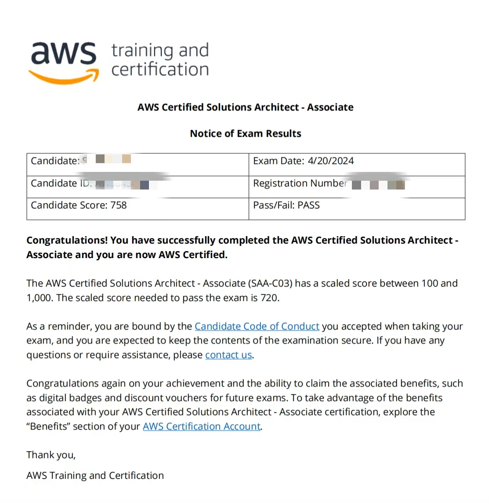

# AWS 认证解决方案架构师助理

简体中文 / [English](./README.md)

AWS Certified Solutions Architect Associate SAA-C03 认证是最具挑战性的考试之一。它不仅可以很好地评估您对 AWS 的理解程度，还可以确保您根据情况做出最佳架构决策，这使得获得并通过该认证非常有价值。

  

## 考试目的
学习架构知识，同时练习英语。

## 学习历程
- 推荐在Udemy上学习Stephane Maarek的课程，我断断续续地听了一个月。
- 刷了800多道英文题，持续一个月。

## 参加考试后了解到的事项
- 如果选择英语作为考试语言，可以在预约考试之前申请语言便利。一旦预约考试，就不能再申请了。
- AWS Builder账号创建时填写的英文姓名必须与相关的辅助文件（如护照）上的姓名保持一致。考试时需要携带身份证和相关辅助证件。
- 如果条件允许，尽量选择线上考试，可以在安静的环境下完成考试。我去参加的是线下考试，在一个开放的教室里，不断有人进出，幸运的是考场提供了降噪耳机。